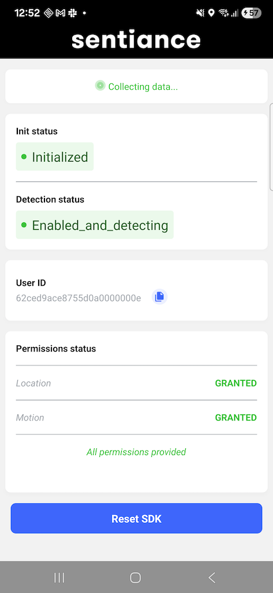

# Sentiance SDK — Expo Sample Application

This sample application demonstrates how to integrate the [Sentiance React Native SDK](https://github.com/sentiance/react-native-sentiance) in an [Expo](https://expo.dev) mobile application.



## What's covered

- SDK user creation with [user linking](https://docs.sentiance.com/important-topics/sdk/appendix/user-linking) via authentication codes
- Location and motion permission management
- Real-time SDK status monitoring (init state, detection status)
- SDK reset flow

The key integration point is `handleCreateUser` in `src/app/index.tsx`.

## Prerequisites

1. Request a developer account by [contacting Sentiance](mailto:support@sentiance.com).
2. Set up a backend to provide authentication codes to the application. See the [sample API server](https://github.com/sentiance/sample-apps-api).

## Setup

1. Install [pnpm](https://pnpm.io) (v10.24.0 or later):
   ```bash
   npm install -g pnpm
   ```

2. Install dependencies:
   ```bash
   pnpm i
   ```

3. Update `src/constants.ts`:
   - Set `BASE_URL` to the URL of your backend that provides authentication codes.
   - Optionally set `PLATFORM_URL` if you use a non-default Sentiance platform URL.

4. Generate native projects:
   ```bash
   pnpm expo prebuild
   ```

5. Run the app:
   ```bash
   # Android
   pnpm expo run:android

   # iOS
   pnpm expo run:ios
   ```

## More info

- [Sentiance SDK documentation](https://docs.sentiance.com/)
- [Sentiance React Native SDK](https://github.com/sentiance/react-native-sentiance)
